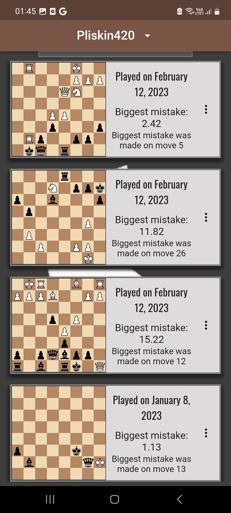
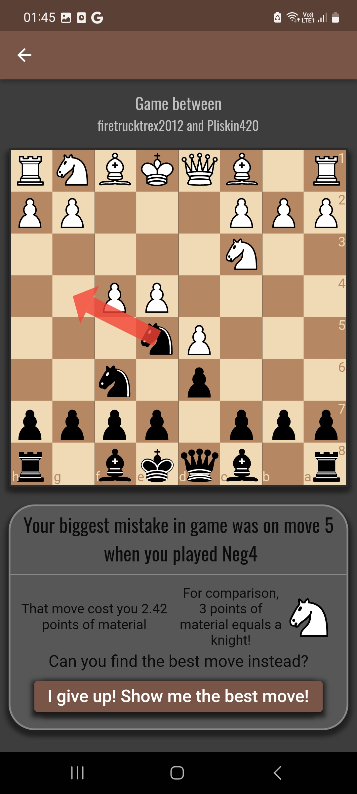

# Chess Champ

Chess Champ is a flutter app meant to help chess players improve on their mistakes using thier [lichess](https://lichess.org) account.

     
    
    

## Bulit with

 Dart/Flutter - main language and framework.

### Most important used dependencies
- [flutter_bloc](https://pub.dev/packages/flutter_bloc) v8.1.2 - A library used for state management
- [cloud_firestore](https://pub.dev/packages/cloud_firestore) v4.4.5 - Cloud hosted database
- [firebase_auth](https://pub.dev/packages/firebase_auth) v4.2.2 - A library used for authentication
- [json_serializable](https://pub.dev/packages/json_serializable) v6.6.1 - A library for automatically generating code for converting to and from JSON
- [dio](https://pub.dev/packages/dio) v5.0.0 -  HTTP client for managing Lichess API
- [retrofit](https://pub.dev/packages/retrofit) v4.0.1 - A dio client generator
- [get_it](https://pub.dev/packages/get_it) v7.2.0 -  Service locator that allows to decouple the interface from a concrete implementation
- [injectable](https://pub.dev/packages/injectable) v2.1.1 - get_it generator
- [freezed](https://pub.dev/packages/freezed) v2.3.2 - Code generation for immutable classes
- [bloc_test](https://pub.dev/packages/bloc_test) v9.1.1 - A testing library for bloc

## Overview

Chess Champ is an app meant to be used to learn chess. It uses [lichess](https://lichess.org) API, worlds biggest free chess website. It allows the user to enter their lichess account and the app downloads their last 10 games. It then calculates the biggest mistake the user made in each of these games and gives the user a chance to try and find the best move instead. Alternatively if user can't find the best move they can press a button to give out the solution.

## How does it work?
- First, user logs in  with an existing account or creates a new one.

https://github.com/dawidwrobel97/chess_champ/assets/117597306/d79f8ea7-d70e-49f1-b2fb-3493f978e1e0

- Then you can enter your lichess account username(or some other person you might want to check)

https://github.com/dawidwrobel97/chess_champ/assets/117597306/93f6d538-44ba-45cb-8f05-9abcf859407f

- From here you can check any of the games in the list. Once opened, the app will show you what was the wrong move you played with a red arrow, along with some stats and a solution button underneath. Now the user can attempt to find what move was best. If you can't find it, you can press the solution button for an answer.

https://github.com/dawidwrobel97/chess_champ/assets/117597306/0ed507f4-e99f-482e-a19c-5f1b0b580c26

At any moment you can delete the current lichess account and use a different one

https://github.com/dawidwrobel97/chess_champ/assets/117597306/d2a6afc6-cabf-479a-a18c-14c40e09c230

